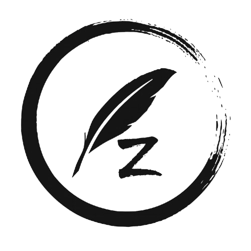
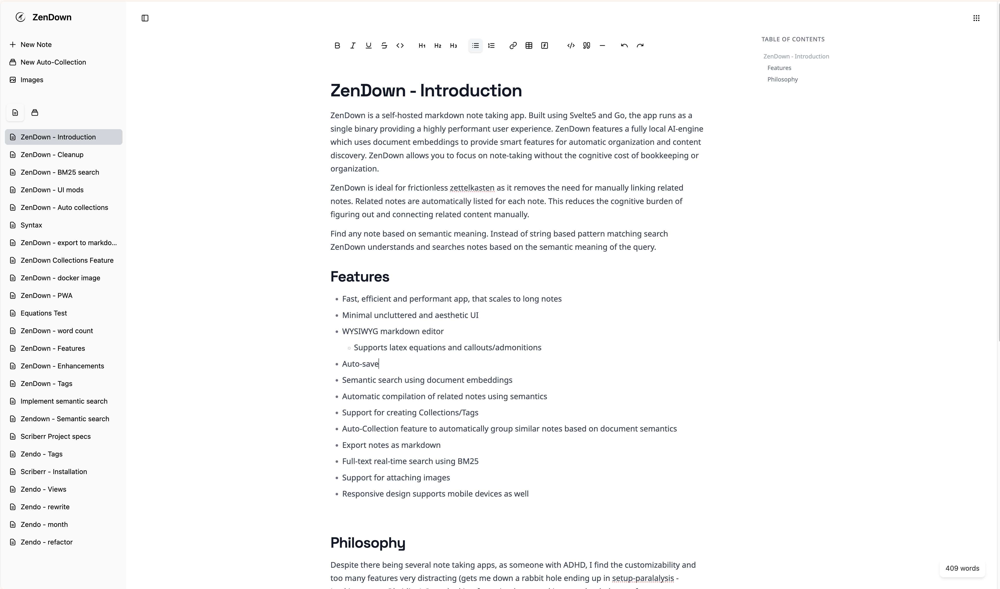
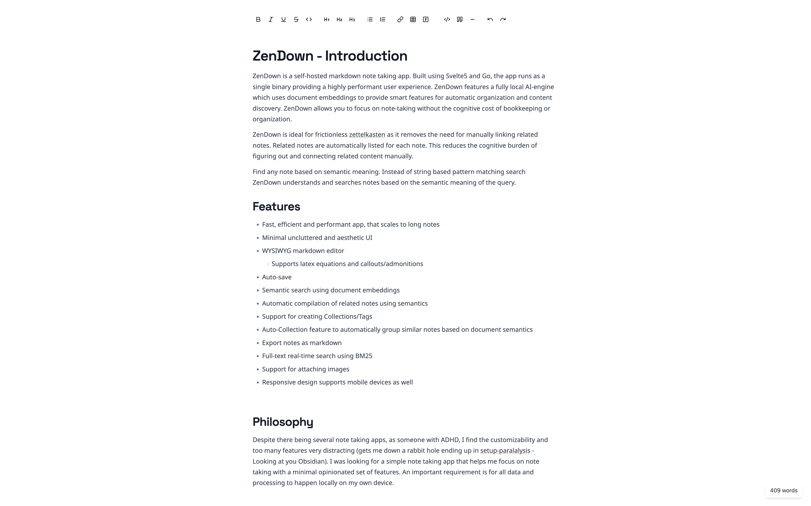

<p align="center">
  
</p>

<h1 align="center">ZenDown</h1>

ZenDown is a self-hosted markdown note taking app. Built using Svelte5 and Go, the app runs as a single binary providing a highly performant user experience. ZenDown features a fully local AI-engine which uses document embeddings to provide smart features for automatic organization and content discovery. ZenDown allows you to focus on note-taking without the cognitive cost of bookkeeping or organization.

ZenDown is ideal for frictionless zettelkasten as it removes the need for manually linking related notes. Related notes are automatically listed for each note. This reduces the cognitive burden of figuring out and connecting related content manually.
Find any note based on semantic meaning. Instead of string based pattern matching search ZenDown understands and searches notes based on the semantic meaning of the query. Automatically organize similar notes into collections based on description

## Philosophy

Despite there being several note taking apps, as someone with ADHD, I find the customizability and too many features very distracting (gets me down a rabbit hole ending up in setup-paralalysis - Looking at you Obsidian). I was looking for a simple note taking app that helps me focus on note taking with a minimal opinionated set of features. An important requirement is for all data and processing to happen locally on my own device.

As someone who suffers from cognitive overload and dissonance, I wanted to remove the cognitive cost associated with organizing notes to make knowledge retrieval straight forward. So I leverage locally running Machine Learning models for addressing this. Loosely based on the zettelkasten system, the ML models make it trivial to find any content the following ways:

* First, it allows searching documents by contextual meaning of the query sentence instead of string pattern matching
* Second, for any note we automatically find and list all notes that are *semantically* similar so you can readily see all notes related to a topic
* Third, auto-collection feature allows automatically grouping together similar notes for easy access

This makes implementing zettelkasten trivial as you no longer need to manually link notes.
Going forward the app will focus on a core set of opinionated features with a strong emphasis on ML/AI based automation for note taking related problems. Of course all ML/AI will be fully local. Checkout the Roadmap section for some of the features planned.

## Features

* Fast, efficient and performant app, that scales to long notes
* Minimal uncluttered and aesthetic UI
* WYSIWYG markdown editor with support for latex equations and callouts/admonitions
* Auto-save
* Support for creating Collections/Tags
* Auto-Collection feature to automatically group similar notes based on document semantics
* Semantic search using document embeddings
* Automatic compilation of related notes using semantics
* Mobile friendly and responsive design allows you to use on any device
* Export notes as markdown
* Full-text real-time search using BM25
* Support for attaching images
* Beautiful zen mode for distraction free writing


## Screenshots





## Installation

ZenDown is available as a docker image and can be deployed with the docker-compose provided below.

````compose
services:
  # SemWare AI service
  semware:
    image: ghcr.io/rishikanthc/semware:v0.1.0
    container_name: zendown-semware
    ports:
      - "8000:8000"
    volumes:
      - ./semware-db:/db
    environment:
      - SEMWARE_API_KEY=test-api-key-12345
    restart: unless-stopped
    networks:
      - zendown-network

  # ZenDown application
  zendown:
    image: ghcr.io/rishikanthc/zendown:latest
    container_name: zendown
    ports:
      - "8080:8080"
    environment:
      # SemWare API Key - must match the one set in SemWare service
      - SEMWARE_API_KEY=test-api-key-12345
      # SemWare URL - points to the SemWare service within the Docker network
      - SEMWARE_URL=http://semware:8000
    volumes:
      # Persist database files
      - ./data:/app/data
      # Persist attachment files
      - ./attachments:/app/attachments
    restart: unless-stopped
    depends_on:
      - semware
    healthcheck:
      test: ["CMD", "curl", "-f", "http://localhost:8080/api/notes"]
      interval: 30s
      timeout: 10s
      retries: 3
      start_period: 40s
    networks:
      - zendown-network

networks:
  zendown-network:
    name: zendown-network
    driver: bridge 
````

## Roadmap

I currently planning to build the following features just to give an idea of the direction the project is headed in. I’m open to feature requests if they solve a meaningful problem in note taking:

* Improve auto-collection 
* Querying system to support [dataview](https://blacksmithgu.github.io/obsidian-dataview/) like queries
* PWA support
* Publish notes on the internet publicly

# Contributing

Contributions are most welcome!
If you have any cool ideas / request for features / any issues please open an
issue in the issue tracker and I’ll get back to you as soon as possible.
Please follow these steps to contribute to development:

1. Fork the repository.
1. Create a feature branch (git checkout -b feature/my-cool-feature).
1. Commit your changes (git commit -m “Add awesome feature”).
1. Push to your branch (git push origin feature/my-cool-feature).
1. Open a Pull Request, describing the change and any setup steps.

# License

This project is licensed under the GNU AGPL License. See LICENSE file for details.

